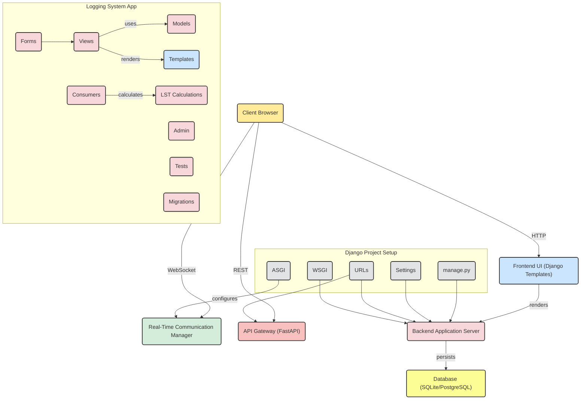

# 🌌 Telescope Logging System

A powerful Django-based web application designed to streamline the logging of astronomical observation sessions. It integrates weather data, real-time sidereal time updates, PDF report generation, email delivery, and FITS file editing into a cohesive and user-friendly system.


## 🚀 Features

The application supports full lifecycle management of telescope observation sessions, including:

### Logging System
- Capture detailed observational data:
  - General session information
  - Telescope and instrumentation configuration
  - Environmental and weather conditions
  - Target observation details
  - Remote operations
  - User comments

### Real-Time UTC & LST Clock
- Live streaming of UTC and Local Sidereal Time using WebSockets
- One-click Start/End log timestamps using real-time values

### Weather Integration
- Real-time weather data fetching (temperature, humidity, wind speed, cloud coverage) from WeatherAPI

### PDF Generation
- Automatically generates a well-formatted PDF report of each session using ReportLab

### Email PDF Delivery
- Email session logs as PDFs via:
  - Predefined admin addresses
  - User-provided email list
  - SMTP login popup for secure email sending

### FITS File Header Injection
- Upload a `.fits` file and inject session metadata into its header fields
- Download the modified FITS file immediately

### Log Filtering & History
- Search logs by:
  - Session ID
  - Operator name
  - Target name
  - Instrument name
  - Observation date

### Authentication
- Login required for logging sessions and accessing log history


## 🛠 Tech Stack

### Backend
- **Python 3.11+**
- **Django 5.1.7**
- **PostgreSQL**
- **Django Channels** – real-time LST updates via WebSockets
- **ReportLab** – PDF generation
- **AstroPy** – FITS file handling
- **requests** – Weather API integration
- **python-dotenv** – Environment variable management

### Frontend
- **Bootstrap 5**
- **Crispy Forms (bootstrap5 pack)**
- **JavaScript** – AJAX & WebSocket client integration
- **Django Templating Engine**

### Deployment
- **WhiteNoise** – Static file serving in production
- **Whitenoise Middleware**


## 🧭 System Architecture




## Prerequisites

Ensure you have the following tools and services installed before setting up the Telescope Logging System:

### 1. **Python 3.11 or higher**
Download: https://www.python.org/downloads/

Check version:
```bash
python --version
```

### 2. **PostgreSQL**
Install PostgreSQL based on your operating system and add PATH to your system variable:
- [Ubuntu/Debian](https://www.postgresql.org/download/linux/ubuntu/)
- [Windows](https://www.enterprisedb.com/downloads/postgres-postgresql-downloads)
- [Mac](https://postgresapp.com/)

Start PostgreSQL and verify access:
```bash
psql -U postgres
```

### 3. **Git**
Required to clone the repository.
```bash
git --version
```

### 4. **Virtual Environment (venv)**
Ensure venv is available with Python:
```bash
python -m venv --help
```

### 5. **SMTP-Compatible Email Account**
You will need an email account to send log reports via SMTP:
- Gmail (App Password recommended)
- Custom SMTP (e.g., `smtp.gmail.com`)

### 6. **WeatherAPI Key**
Get a free API key from: https://www.weatherapi.com/


## 📦 Installation Guide

Follow these steps to install and run the application locally:

### 1. Clone the Repository
```bash
git clone https://github.com/RadadiyaAditya/Telescope_Logging.git
cd Telescope_Logging
```

### 2. Create a Python Virtual Environment
```bash
python -m venv tele
source tele/bin/activate  # Windows: tele\Scripts\activate
```

### 3. Install Python Dependencies
```bash
pip install -r requirements.txt
```

### 4. Configure Environment Variables
Create a `.env` file in the root directory:
```ini
DJANGO_SECRET_KEY=your-django-secret-key
DEBUG=True

# PostgreSQL
DATABASE_NAME=your_db_name     (eg. telescope_log)
DATABASE_USER=your_db_user     (eg. telescope_user)
DATABASE_PASSWORD=your_db_password    (eg. tele123)
DATABASE_HOST=localhost
DATABASE_PORT=5432

# Email
EMAIL_HOST_USER=your_email@gmail.com
EMAIL_HOST_PASSWORD=your_email_password

# Weather API
Weather_API=your_weatherapi_key
```

### 5. Set Up PostgreSQL Database

Start PostgreSQL and verify access:
```bash
psql -U postgres
```

Log into PostgreSQL and execute:
```sql
CREATE DATABASE telescope_log;
CREATE USER telescope_user WITH PASSWORD 'tele123';
GRANT ALL PRIVILEGES ON DATABASE telescope_log TO telescope_user;
ALTER DATABASE telescope_log OWNER TO telescope_user;
```

### 6. Apply Django Migrations
```bash
python manage.py makemigrations
python manage.py migrate
```

### 7. Create a Superuser Account
```bash
python manage.py createsuperuser
```

### 8. Run the Server
```bash
daphne -b 0.0.0.0 -p 8000 telescope_log.asgi:application
```

Visit: [http://127.0.0.1:8000/](http://127.0.0.1:8000/)


## 📁 Project Structure
```
├── logging_system/
│   ├── views.py
│   ├── forms.py
│   ├── models.py
│   ├── urls.py
│   ├── templates/
│   ├── static/
├── telescope_log/
│   ├── settings.py
│   ├── urls.py
│   ├── asgi.py
│   ├── wsgi.py
├── manage.py
├── requirements.txt
├── .env
```


## 🔒 Security Best Practices
- Always set `DEBUG=False` in production.
- Never commit your `.env` file to version control.
- Use TLS (port 587 or 465) when sending email via SMTP.


## 📬 License & Contact
This project is private unless otherwise stated. For collaboration, support, or licensing requests, please contact the repository owner.

---
