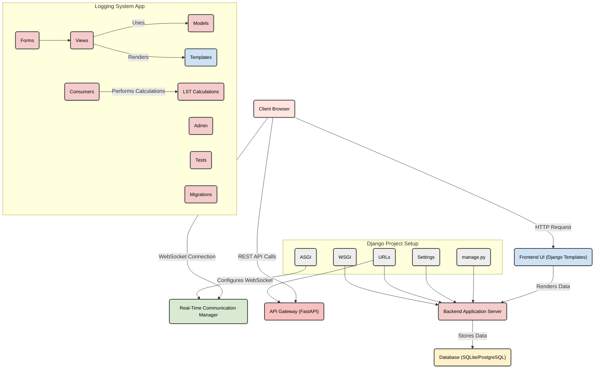

# Telescope Log Web Application

## Overview

A **web-based Telescope Logging System** built with **Django (Framework)** and **PostrgreSQL (Database)** to facilitate **astronomical observation logging**. It includes features such as user authentication, real-time updates using Django Channels, and PDF report generation.

## Features

- User authentication and management
- Real-time updates with Django Channels
- PDF report generation using `pdfkit`
- Responsive design with Bootstrap 5

## Tech Stack

- **Backend:** Django
- **Frontend:** HTML, Django Templates
- **Database:** PostgreSQL / SQLite
- **Real-time Communication:** Django Channels (WebSockets)
- **Version Control:** Git & GitHub

## Diagram


## Installation

### Prerequisites

- Python 3.8+
- PostgreSQL
- wkhtmltopdf

### Setup

1. Clone the repository:
    ```sh
    git clone https://github.com/yourusername/telescope_log_webapp.git
    cd telescope_log_webapp
    ```

2. Create and activate a virtual environment:
    ```sh
    python -m venv venv
    source venv/bin/activate  # On Windows use `venv\Scripts\activate`
    ```

3. Install the required packages:
    ```sh
    pip install -r requirements.txt
    ```

4. Set up the PostgreSQL database and update the `.env` file with your database credentials:
    ```
    DATABASE_NAME=your_db_name
    DATABASE_USER=your_db_user
    DATABASE_PASSWORD=your_db_password
    DATABASE_HOST=your_db_host
    DATABASE_PORT=your_db_port
    ```

5. Apply the database migrations:
    ```sh
    python manage.py migrate
    ```

6. Collect static files:
    ```sh
    python manage.py collectstatic
    ```

7. Run the development server:
    ```sh
    daphne -b 0.0.0.0 -p 8000 telescope_log.asgi:application
    ```

## Configuration

### Environment Variables

Create a `.env` file in the root directory and add the following environment variables:

```
DJANGO_SECRET_KEY=your_secret_key
DEBUG=False
ALLOWED_HOSTS=localhost,127.0.0.1
DATABASE_NAME=your_db_name
DATABASE_USER=your_db_user
DATABASE_PASSWORD=your_db_password
DATABASE_HOST=your_db_host
DATABASE_PORT=your_db_port
```

### PDFKit Configuration

Ensure `wkhtmltopdf` is installed and update the `WKHTMLTOPDF_PATH` in `settings.py`:

```python
WKHTMLTOPDF_PATH = r"C:\Program Files\wkhtmltopdf\bin\wkhtmltopdf.exe"
PDFKIT_CONFIG = pdfkit.configuration(wkhtmltopdf=WKHTMLTOPDF_PATH)
```

## Usage

### Running the Server

To start the server, run:

```sh
daphne -b 0.0.0.0 -p 8000 telescope_log.asgi:application
```

### Accessing the Application

Open your web browser and navigate to `http://127.0.0.1:8000/`.

### Admin Interface

Access the Django admin interface at `http://127.0.0.1:8000/admin/`. Use the superuser credentials created during the setup.

## Contributing

Contributions are welcome! Please follow these steps:

1. Fork the repository.
2. Create a new branch (`git checkout -b feature-branch`).
3. Make your changes.
4. Commit your changes (`git commit -m 'Add new feature'`).
5. Push to the branch (`git push origin feature-branch`).
6. Create a new Pull Request.

## License

This project is licensed under the MIT License. See the [LICENSE](LICENSE.txt) file for details.

## Acknowledgements

- [Django](https://www.djangoproject.com/)
- [Bootstrap](https://getbootstrap.com/)
- [wkhtmltopdf](https://wkhtmltopdf.org/)
